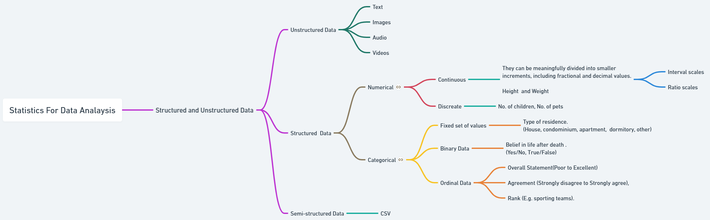

# Essential Statistical Concepts For Data Analysts
---

The objective of this course is to streamline the understanding of fundamental statistical concepts for aspiring Data Analysts who are new to the field.

---

| Number | Notebook | 
| ----- |  ----- |  
| 00 | [Home](https://github.com/everndah/Statistics_For_Data_Analysis/blob/main/docs/index.md) |
| 01 | [01_Structured_and_Unstructured_Data](https://github.com/everndah/Statistics_For_Data_Analysis/blob/main/docs/01_Structured_and_Unstructured_Data.ipynb) |